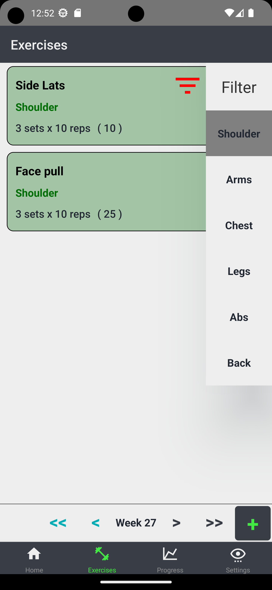
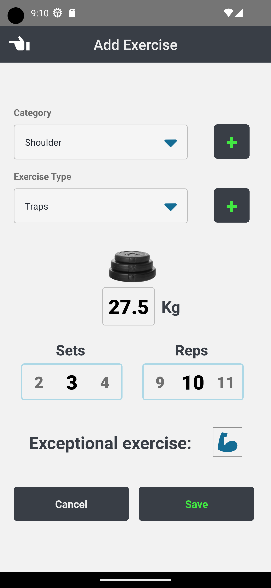
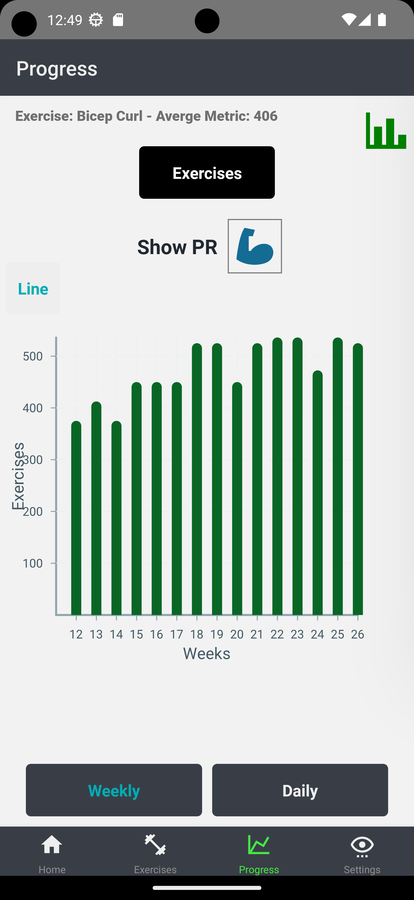
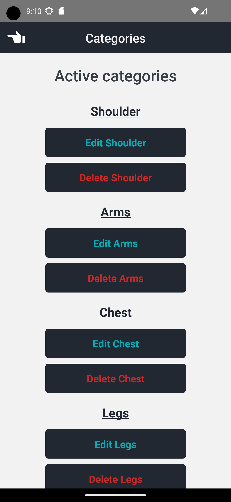
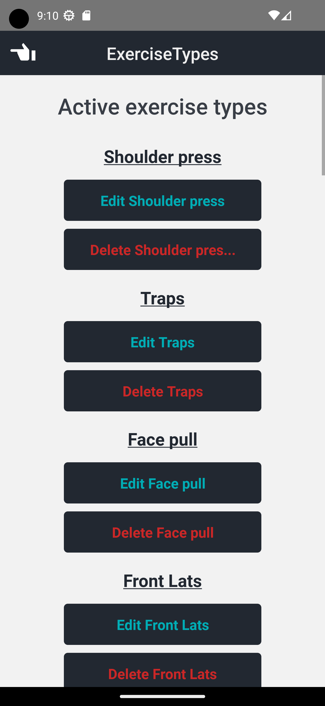

# Hypertrophy Exercise App

Welcome to the Hypertrophy Exercise App! This app is designed to help you keep track of your exercises and progress towards your fitness goals.

[Link to app on google play store](https://play.google.com/store/apps/details?id=com.hypertrophy)

## Screens

The app has four main screens:

1. Home - The home screen where you keep track of your current week. Here you can also add plans for the current week, which when you complete them the exercise will be added to your exerciselist.
Adding an exercise for which there is a plan with the same exercise type will either autocomplete the plan or ask you if you wish to do so, depending on if you meet the criteria for the plan.

   

2. Exercise List - This screen allows you to add exercises and input the amount of sets and reps you did for each exercise. You can also specify the category that each exercise belongs to, such as Arms or Shoulders. As you use the app, you can set up these categories to suit your needs. The Exercise List screen also features a sidebar that allows you to filter exercises by category. Exercises can also be edited \ deleted within the same day as you created them.

   
   
   

3. Progress - On the Progress screen, you can keep track of your progress over time. The app shows you how many exercises you did each day, or each week, displayed on a graph.

   
   
   

4. Settings - The Settings screen, here you can edit or delete your categories / exercise types, change colors, read more about the app etc. 

   
   
   