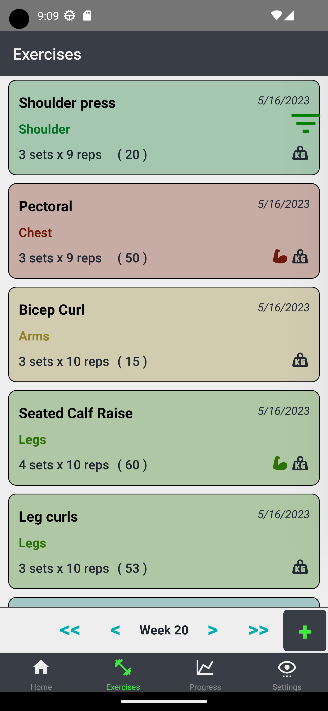
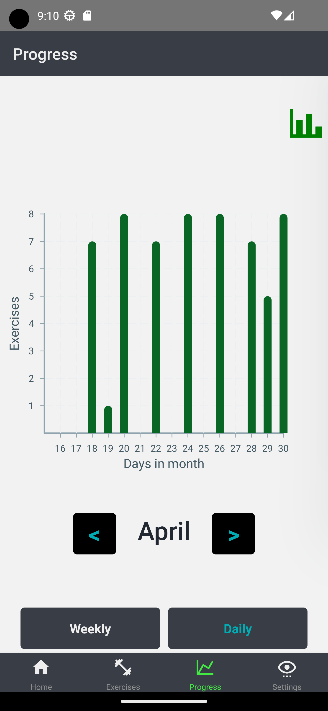

# Hypertrophy Exercise App

Welcome to the Hypertrophy Exercise App! This app is designed to help you keep track of your exercises and progress towards your fitness goals.

## Screens

The app has three main screens:

1. Exercise List - This screen allows you to add exercises and input the amount of sets and reps you did for each exercise. You can also specify the category that each exercise belongs to, such as Arms or Shoulders. As you use the app, you can set up these categories to suit your needs. The Exercise List screen also features a sidebar that allows you to filter exercises by category.

   
   

2. Progress - On the Progress screen, you can keep track of your progress over time. The app shows you how many exercises you did each day, displayed on a graph. In the future, the app will also allow you to filter the specific exercises you want to show on the graph and adjust the date range.

   

3. Settings - The Settings screen (not yet implemented) will allow you to customize the app to suit your needs.

   
